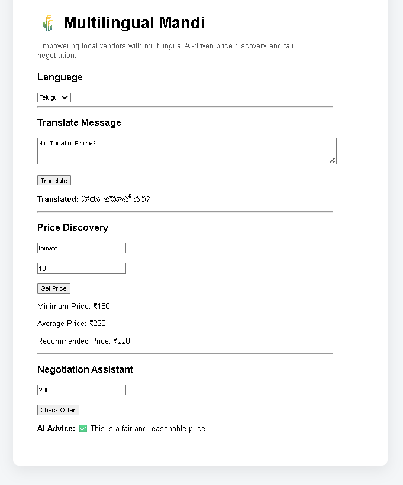

# 🌾 Multilingual Mandi -- AI for Bharat 🇮🇳

> AI-powered multilingual marketplace assistant designed to empower **local Indian mandi vendors and buyers** through transparent pricing and language accessibility.

Built for the **26 January Prompt Challenge -- AI for Bharat**.

------------------------------------------------------------------------

# 📖 Overview

In many Indian mandis (local markets), farmers and buyers face two major
problems:

-   🌐 **Language barriers** between buyers and sellers\
-   💰 **Unclear or unfair pricing** during negotiations

**Multilingual Mandi** solves this using AI by providing:

-   Real-time **language translation**
-   **AI-powered price suggestions**
-   **Negotiation assistance**

The goal is to make mandi transactions **fair, transparent, and
accessible for everyone in Bharat.**

------------------------------------------------------------------------

# 🚀 Key Features

### 🌐 Multilingual Communication

AI-powered translation enabling vendors and buyers to communicate in
different Indian languages.

Example: - Farmer speaks Telugu\
- Buyer speaks Hindi\
- AI translates conversation instantly

------------------------------------------------------------------------

### 📊 AI Price Discovery

Provides intelligent price guidance using mandi-style data:

-   Minimum market price\
-   Average mandi price\
-   Recommended selling price

Helps farmers **avoid underpricing their crops.**

------------------------------------------------------------------------

### 🤝 Smart Negotiation Assistant

AI analyzes offers and suggests whether the deal is:

-   ❌ Too Low\
-   ⚖ Fair Price\
-   ✅ Good Deal

This helps farmers **make confident selling decisions.**

------------------------------------------------------------------------

### 📱 Simple Web Interface

Designed for ease of use by local vendors.

-   Simple UI\
-   Fast responses\
-   Accessible from low-end devices

------------------------------------------------------------------------

# 🛠 Tech Stack

### Frontend

-   React
-   Vite
-   JavaScript
-   CSS

### Backend

-   Node.js
-   Express
-   REST APIs

### AI Development

-   Prompt-driven architecture using **Kiro**

### Deployment

-   GitHub for version control
-   Web-based interface for accessibility

------------------------------------------------------------------------

# 📸 Screenshots

### Dashboard Overview

------------------------------------------------------------------------

# 🇮🇳 Bharat Impact

Multilingual Mandi contributes to **Digital Agriculture and Inclusive
Markets** by:

-   Breaking **language barriers in local markets**
-   Improving **price transparency**
-   Helping **small vendors negotiate better**
-   Supporting the vision of **Viksit Bharat**

------------------------------------------------------------------------

# 📁 Project Structure

    Multilingual-Mandi/
    │
    ├── frontend/        # React + Vite UI
    ├── backend/         # Node.js + Express APIs
    ├── screenshots/     # Project screenshots
    └── README.md

------------------------------------------------------------------------

# ⚙️ Running the Project Locally

### 1️⃣ Clone the repository

    git clone https://github.com/NRR385/Multilingual-Mandi.git
    cd Multilingual-Mandi

### 2️⃣ Start Backend

    cd backend
    npm install
    node server.js

### 3️⃣ Start Frontend

    cd frontend
    npm install
    npm run dev

Open:

    http://localhost:5173

------------------------------------------------------------------------

# 📌 Challenge Details

**Event:** 26 January Prompt Challenge\
**Theme:** AI for Bharat 🇮🇳

This project demonstrates how **AI can empower local economies and
agricultural markets.**

------------------------------------------------------------------------

⭐ If you found this project interesting, consider giving it a **star on
GitHub!**
