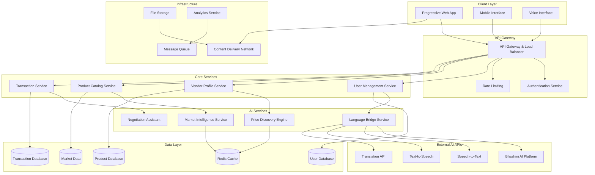

# Design Document: Multilingual Mandi Challenge

## Overview

The Multilingual Mandi Challenge platform is a comprehensive web-based marketplace that leverages AI to bridge linguistic and commercial gaps in India's local markets. The system integrates real-time multilingual translation, intelligent price discovery, and negotiation assistance to create an inclusive digital trading environment for vendors and buyers across India's diverse linguistic landscape.

The platform follows a microservices architecture with specialized AI services for language processing, price optimization, and market intelligence, all wrapped in a mobile-first Progressive Web Application (PWA) interface.

## Architecture

### High-Level Architecture



### Technology Stack

**Frontend:**
- Progressive Web App (PWA) with React/Next.js
- Responsive design with Tailwind CSS
- Voice interface integration with Web Speech API
- Offline-first architecture with service workers

**Backend:**
- Node.js/Express.js microservices
- API Gateway with rate limiting and authentication
- WebSocket connections for real-time features
- Message queue system (Redis/RabbitMQ)

**AI Integration:**
- Bhashini AI Platform for Indian language processing
- Custom machine learning models for price discovery
- Natural language processing for negotiation assistance
- Real-time translation and speech processing

**Database:**
- PostgreSQL for transactional data
- MongoDB for product catalogs and market data
- Redis for caching and session management
- Time-series database for market analytics

## Components and Interfaces

### Language Bridge Service

The Language Bridge Service provides comprehensive multilingual support across all platform interactions.

**Core Components:**
- **Translation Engine**: Integrates with Bhashini AI for real-time translation across 22 Indian languages
- **Speech Processing**: Handles voice input/output with speech-to-text and text-to-speech capabilities
- **Context Preservation**: Maintains commercial terminology and cultural context during translation
- **Dialect Adaptation**: Recognizes and adapts to regional dialects and local market terminology

**Key Interfaces:**
```typescript
interface LanguageBridgeService {
  translateText(text: string, fromLang: string, toLang: string): Promise<TranslationResult>
  processVoiceInput(audioData: Blob, language: string): Promise<SpeechResult>
  generateVoiceOutput(text: string, language: string, voice: VoiceProfile): Promise<AudioBlob>
  detectLanguage(text: string): Promise<LanguageDetectionResult>
  preserveContext(text: string, domain: CommerceDomain): Promise<ContextualTranslation>
}

interface TranslationResult {
  translatedText: string
  confidence: number
  preservedTerms: string[]
  culturalAdaptations: string[]
}
```

### Price Discovery Engine

The Price Discovery Engine uses machine learning algorithms to analyze market conditions and provide optimal pricing recommendations.

**Core Components:**
- **Market Data Analyzer**: Processes historical and real-time market data
- **Seasonal Trend Processor**: Incorporates seasonal patterns and agricultural cycles
- **Location-Based Pricing**: Adjusts recommendations based on geographic market conditions
- **Competitive Analysis**: Monitors competitor pricing and market positioning
- **Demand Forecasting**: Predicts demand patterns using time-series analysis

**Key Interfaces:**
```typescript
interface PriceDiscoveryEngine {
  generatePriceRecommendation(product: Product, vendor: Vendor): Promise<PriceRecommendation>
  analyzeMarketTrends(productCategory: string, location: Location): Promise<MarketTrends>
  updateRealTimePricing(marketConditions: MarketConditions): Promise<PriceUpdate[]>
  calculateSeasonalAdjustment(product: Product, timeframe: DateRange): Promise<SeasonalFactor>
}

interface PriceRecommendation {
  suggestedPrice: number
  priceRange: { min: number; max: number }
  confidenceLevel: number
  influencingFactors: PricingFactor[]
  marketPosition: 'competitive' | 'premium' | 'value'
}
```

### Negotiation Assistant

The Negotiation Assistant provides AI-powered guidance during price negotiations while respecting cultural norms.

**Core Components:**
- **Cultural Context Engine**: Understands local negotiation customs and practices
- **Fairness Evaluator**: Assesses offer fairness based on market data
- **Compromise Generator**: Suggests mutually beneficial solutions
- **Communication Facilitator**: Maintains respectful tone and prevents aggressive tactics

**Key Interfaces:**
```typescript
interface NegotiationAssistant {
  suggestOpeningOffer(product: Product, marketData: MarketData): Promise<NegotiationSuggestion>
  evaluateCounteroffer(offer: Offer, marketContext: MarketContext): Promise<OfferEvaluation>
  generateCompromise(buyerOffer: number, sellerPrice: number): Promise<CompromiseSuggestion>
  adaptToCulturalContext(negotiation: Negotiation, location: Location): Promise<CulturalGuidance>
}

interface NegotiationSuggestion {
  suggestedOffer: number
  reasoning: string
  culturalConsiderations: string[]
  expectedResponse: string
}
```

### Market Intelligence Service

The Market Intelligence Service aggregates and analyzes market data to provide actionable insights.

**Core Components:**
- **Data Aggregator**: Collects data from multiple sources including transactions, external APIs, and government databases
- **Trend Analyzer**: Identifies patterns and trends in market behavior
- **Anomaly Detector**: Flags unusual market conditions or pricing irregularities
- **Insight Generator**: Creates actionable recommendations for vendors and buyers

**Key Interfaces:**
```typescript
interface MarketIntelligenceService {
  generateMarketReport(category: string, location: Location): Promise<MarketReport>
  detectPriceAnomalies(marketData: MarketData[]): Promise<Anomaly[]>
  predictDemandTrends(product: Product, timeframe: DateRange): Promise<DemandForecast>
  analyzeCompetitorActivity(vendor: Vendor): Promise<CompetitorAnalysis>
}

interface MarketReport {
  averagePrices: PriceData[]
  demandTrends: TrendData[]
  seasonalPatterns: SeasonalData[]
  recommendations: MarketRecommendation[]
}
```

## Data Models

### User and Vendor Models

```typescript
interface User {
  id: string
  phoneNumber: string
  preferredLanguage: LanguageCode
  location: Location
  userType: 'vendor' | 'buyer' | 'both'
  verificationStatus: 'pending' | 'verified' | 'rejected'
  createdAt: Date
  lastActiveAt: Date
}

interface Vendor extends User {
  shopName: string
  shopDescription: string
  categories: ProductCategory[]
  operatingHours: OperatingHours
  marketRegistration?: string
  communityEndorsements: Endorsement[]
  averageRating: number
  totalTransactions: number
}

interface Location {
  latitude: number
  longitude: number
  address: string
  city: string
  state: string
  pincode: string
  marketName?: string
}
```

### Product and Inventory Models

```typescript
interface Product {
  id: string
  vendorId: string
  name: string
  description: string
  category: ProductCategory
  subcategory: string
  images: string[]
  basePrice: number
  currentPrice: number
  unit: 'kg' | 'piece' | 'liter' | 'dozen'
  availableQuantity: number
  qualityGrade?: 'A' | 'B' | 'C'
  harvestDate?: Date
  expiryDate?: Date
  isNegotiable: boolean
  tags: string[]
  createdAt: Date
  updatedAt: Date
}

interface ProductCategory {
  id: string
  name: string
  nameTranslations: Record<LanguageCode, string>
  parentCategory?: string
  seasonalityPattern: SeasonalPattern
  typicalPriceRange: { min: number; max: number }
}
```

### Transaction and Negotiation Models

```typescript
interface Transaction {
  id: string
  buyerId: string
  vendorId: string
  productId: string
  quantity: number
  agreedPrice: number
  totalAmount: number
  negotiationHistory: NegotiationStep[]
  paymentMethod: PaymentMethod
  paymentStatus: 'pending' | 'completed' | 'failed' | 'refunded'
  deliveryDetails?: DeliveryDetails
  status: 'initiated' | 'negotiating' | 'agreed' | 'completed' | 'cancelled'
  createdAt: Date
  completedAt?: Date
}

interface NegotiationStep {
  id: string
  participantId: string
  participantType: 'buyer' | 'vendor'
  offerAmount: number
  message?: string
  aiSuggestion?: string
  timestamp: Date
  language: LanguageCode
}
```

### Market Data Models

```typescript
interface MarketData {
  id: string
  productCategory: string
  location: Location
  averagePrice: number
  priceRange: { min: number; max: number }
  volume: number
  demandLevel: 'low' | 'medium' | 'high'
  supplyLevel: 'low' | 'medium' | 'high'
  seasonalFactor: number
  timestamp: Date
  dataSource: 'platform' | 'government' | 'external'
}

interface PricingFactor {
  factor: string
  impact: 'positive' | 'negative' | 'neutral'
  weight: number
  description: string
}
```

## Correctness Properties

*A property is a characteristic or behavior that should hold true across all valid executions of a system—essentially, a formal statement about what the system should do. Properties serve as the bridge between human-readable specifications and machine-verifiable correctness guarantees.*

Before defining the correctness properties, I need to analyze the acceptance criteria from the requirements document to determine which ones are testable as properties.

Based on the prework analysis, I'll now define the key correctness properties that validate the system's behavior:

### Property 1: Comprehensive Language Translation
*For any* platform content and any supported Indian language pair, the Language_Bridge should translate all content accurately while preserving commercial terminology and cultural context.
**Validates: Requirements 1.1, 1.2, 1.3**

### Property 2: Speech Processing Round Trip
*For any* voice input in a supported language, converting speech to text and then back to speech should preserve the original meaning and commercial context.
**Validates: Requirements 1.4**

### Property 3: Price Discovery Consistency
*For any* product listing, the Price_Discovery_Engine should generate price recommendations that incorporate all relevant factors (market conditions, seasonality, location) and provide transparent reasoning.
**Validates: Requirements 2.1, 2.2, 2.3, 2.4, 2.5**

### Property 4: Negotiation Fairness and Cultural Sensitivity
*For any* negotiation session, the Negotiation_Assistant should provide culturally appropriate suggestions that maintain fairness and respectful communication throughout the process.
**Validates: Requirements 3.1, 3.2, 3.3, 3.4, 3.5**

### Property 5: Vendor Profile Completeness
*For any* vendor registration, the platform should capture and verify all required profile information (shop details, location, specialties, operating hours) and maintain data integrity.
**Validates: Requirements 4.1, 4.2, 4.5**

### Property 6: Real-time Inventory Synchronization
*For any* inventory change, the platform should update product availability immediately and reflect changes in all search results and product displays.
**Validates: Requirements 4.3, 4.4**

### Property 7: Comprehensive Search and Discovery
*For any* product search query, the platform should return results ranked by relevance (location, price, availability) and support all specified filtering and comparison capabilities.
**Validates: Requirements 5.1, 5.2, 5.3, 5.4, 5.5**

### Property 8: Market Intelligence Accuracy
*For any* market data request, the platform should provide current trends, detect anomalies, and generate insights while maintaining user privacy through data anonymization.
**Validates: Requirements 6.1, 6.2, 6.3, 6.4, 6.5**

### Property 9: Transaction Security and Completeness
*For any* transaction, the platform should provide secure payment options, generate digital receipts, maintain transaction history, and implement appropriate security measures based on transaction value.
**Validates: Requirements 7.1, 7.3, 7.4, 7.5**

### Property 10: Dispute Resolution Accessibility
*For any* transaction dispute, the platform should offer multilingual mediation services and maintain fair resolution processes.
**Validates: Requirements 7.2**

### Property 11: Mobile Responsiveness and Offline Capability
*For any* mobile device access, the platform should provide responsive interface optimization and maintain basic functionality during poor connectivity conditions.
**Validates: Requirements 8.1, 8.2, 8.4**

### Property 12: Data Privacy and Security Compliance
*For any* user data collection or processing, the platform should implement proper encryption, obtain explicit consent, support data deletion rights, and enforce multi-factor authentication for sensitive operations.
**Validates: Requirements 9.1, 9.2, 9.3, 9.4**

### Property 13: Accessibility Standards Compliance
*For any* user interaction, the platform should meet accessibility standards to support users with disabilities.
**Validates: Requirements 8.5**

### Property 14: External System Integration
*For any* integration requirement, the platform should provide functional APIs for market management systems, government schemes, logistics services, and POS systems while accommodating traditional workflows.
**Validates: Requirements 10.1, 10.2, 10.3, 10.4, 10.5**

## Error Handling

### Language Processing Errors
- **Translation Failures**: Fallback to English or Hindi when translation services are unavailable
- **Speech Recognition Errors**: Provide visual feedback and alternative input methods
- **Dialect Detection Issues**: Default to standard language variants with user correction options

### Price Discovery Errors
- **Market Data Unavailability**: Use cached historical data with appropriate disclaimers
- **Algorithm Failures**: Provide manual pricing options with market guidance
- **External API Failures**: Implement circuit breakers and graceful degradation

### Transaction Errors
- **Payment Failures**: Retry mechanisms with alternative payment methods
- **Network Connectivity Issues**: Queue transactions for processing when connectivity resumes
- **Dispute Resolution Failures**: Escalate to human mediators with multilingual support

### Data Integrity Errors
- **Database Inconsistencies**: Implement eventual consistency with conflict resolution
- **Cache Invalidation Issues**: Automatic cache refresh with fallback to database queries
- **File Upload Failures**: Retry mechanisms with progress indicators

## Testing Strategy

### Dual Testing Approach

The testing strategy employs both unit testing and property-based testing to ensure comprehensive coverage:

**Unit Testing Focus:**
- Specific examples of language translation accuracy
- Edge cases in price calculation algorithms
- Integration points between microservices
- Error handling scenarios and fallback mechanisms
- Cultural context preservation in specific scenarios

**Property-Based Testing Focus:**
- Universal translation properties across all language pairs
- Price discovery consistency across all market conditions
- Negotiation fairness across all cultural contexts
- Search result accuracy across all query types
- Data security compliance across all user interactions

### Property-Based Testing Configuration

**Testing Framework:** 
- JavaScript/TypeScript: fast-check library
- Minimum 100 iterations per property test
- Each test tagged with: **Feature: multilingual-mandi-challenge, Property {number}: {property_text}**

**Test Data Generation:**
- Multilingual text generators for all supported Indian languages
- Market data generators with seasonal and regional variations
- User behavior simulators for negotiation scenarios
- Product catalog generators with diverse categories and pricing

**Integration Testing:**
- End-to-end user journeys across language barriers
- Cross-service communication validation
- External API integration reliability
- Mobile device compatibility across different screen sizes and network conditions

**Performance Testing:**
- Real-time translation latency under load
- Price discovery algorithm response times
- Database query optimization validation
- CDN and caching effectiveness measurement

### Continuous Testing Pipeline

- Automated property tests run on every code commit
- Integration tests execute on staging environment deployments
- Performance benchmarks validate against SLA requirements
- Security scans ensure compliance with data protection standards
- Accessibility audits verify WCAG compliance

The testing strategy ensures that the platform maintains its core promise of inclusive, transparent, and efficient digital commerce across India's diverse linguistic and cultural landscape.